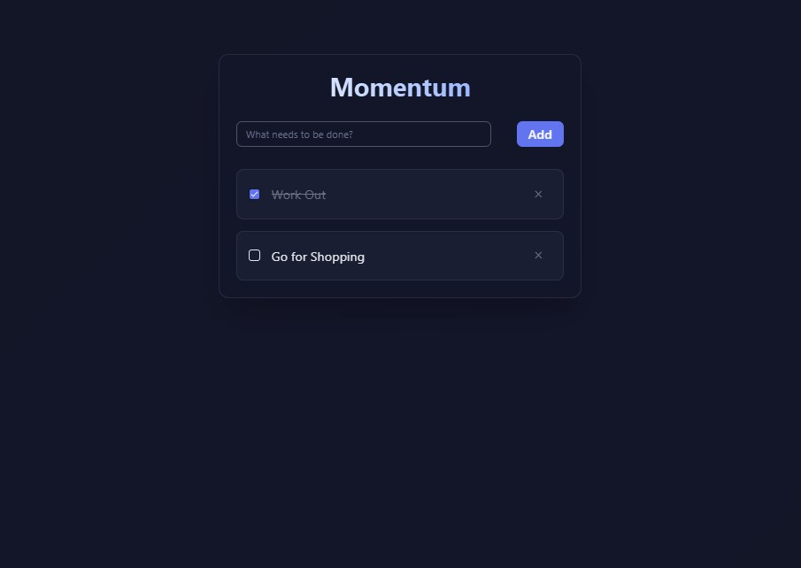

# 🚀 Momentum - A Minimalist Task Manager

  
**Momentum** is a clean, distraction-free task manager built for simplicity and focus. Designed with a minimalist aesthetic, it helps you stay on top of your daily goals without the clutter of complex interfaces. Perfect for users who value productivity through clarity.

---

## ✨ Features

- 🧘 Minimalist UI to keep you focused
- ✅ Quick task creation and completion
- 🕒 Daily view to keep your to-dos organized
- 💡 Light/dark mode support (optional)
- 📱 Fully responsive on all devices

---

## 📷 Preview

 
---

## ⚙️ Installation

Clone the repository:

```bash
git clone https://github.com/mentorbuteyodev/momentum-todo-app.git
cd momentum
npm run dev